# OSLabs

使用NASM汇编以及C++(内嵌MASM)编写的实模式操作系统，以及一个汇编编写的QQ堂图形化游戏

## 前言

这是我大二下学期的操作系统课以及汇编课的实验项目，觉得做得比较有趣，所以就整理了一下。我花了比较多的时间做这两门课程的实验，我还挖了一个大坑，用16位NASM+32位G++编写操作系统，遇到的问题实在太多了。可以举一个比较奇怪的Bug: [kernel.asm](lab8/source/kernel.asm)的第400行，当时的NASM如果不加上nop语句，就会丢失之后的一条pop语句。我想把我的解决方法分享出来。

同时也感谢教我这两门课程的凌应标老师！谢谢！

有什么问题欢迎Issue，我一定会回答的:-)

## 实验特色

NASM汇编(16位) + g++(32位，内嵌MASM)编写的*实模式*操作系统，以及NASM汇编(16位) + gcc(32位)编写的实模式图形化游戏。

坑点在于如何解决16位NASM与32位g++的兼容问题，比如：

由于32位g++生成的栈操作汇编指令是32位的，必须将C++的函数参数放在寄存器中；如果要用C++实现中断功能，需要在C++中使用内嵌汇编进行栈操作命令调整。

## 内容说明

### lab1 接管裸机的控制权

设计IBM_PC的一个引导扇区程序，程序功能是：用字符‘A’从屏幕左边某行位置45度角下斜射出，保持一个可观察的适当速度直线运动，碰到屏幕的边后产生反射，改变方向运动，如此类推，不断运动；在此基础上，增加你的个性扩展，如同时控制两个运动的轨迹，或炫酷动态变色，个性画面，如此等等，自由不限。还要在屏幕某个区域特别的方式显示你的学号姓名等个人信息。将这个程序的机器码放进放进第三张虚拟软盘的首扇区，并用此软盘引导你的XXXPC，直到成功。

### lab2 加载用户程序的监控系统

设计四个（或更多）有输出的用户可执行程序

设计四个有输出的用户可执行程序，分别在屏幕1/4区域动态输出字符，如将用字符‘A’从屏幕左边某行位置45度角下斜射出，保持一个可观察的适当速度直线运动，碰到屏幕相应1/4区域的边后产生反射，改变方向运动，如此类推，不断运动；在此基础上，增加你的个性扩展，如同时控制两个运动的轨迹，或炫酷动态变色，个性画面，如此等等，自由不限。还要在屏幕某个区域特别的方式显示你的学号姓名等个人信息。

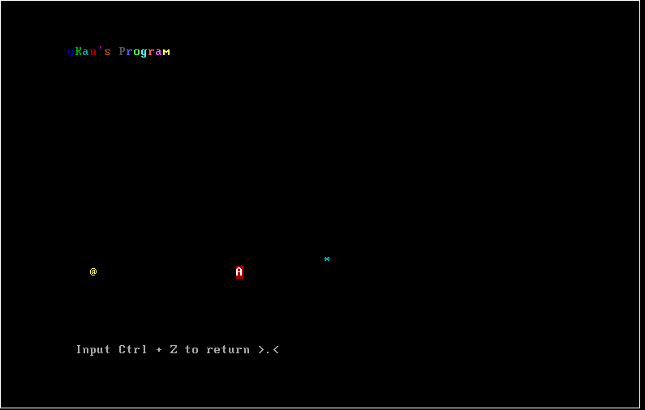

### lab3 用 C 和汇编实现操作系统内核

1. 该系统为分时系统，同时支持批处理
2. 在内存允许下, 该分时系统支持动态创建进程
3. 可以根据进程的 ID 值杀死进程, 也可以一次杀死全部进程
4. 有良好的控制台界面, 方便的命令行, 用户界面切换方式
5. 支持检查指令, 判断正确性
6. 使用了 g++ 和 nasm 交叉编译, 运行的环境为 16 进制实模式
7. 使用了 C++ 内嵌汇编(MASM)
8. 支持函数互调

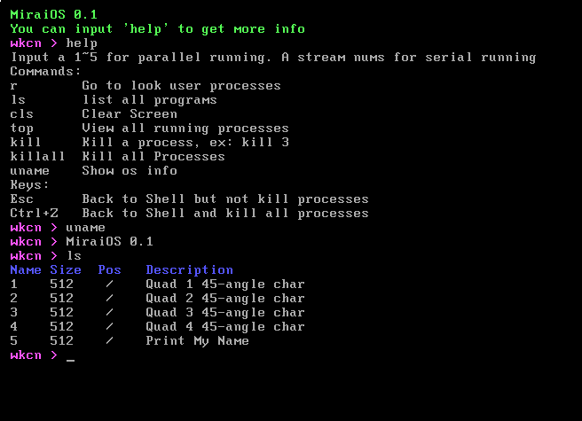

### lab4 在 FAT12盘结构中引导操作系统

1. 另建一个段, 专门存放 PCB, 分时系统管理的进程数可达16个!
理论上, 最大进程数为: 0xFFFF / PCBSize 向下取整.
同一程序可以有多个进程.
2. 自行创建 int 20h 中断, 模拟 DOS 从用户程序返回 Shell
3. 使用内嵌汇编 + C++结构比较完美读取 BPB, EBPB 信息
4. 使用 C++结合内嵌汇编加载用户程序
5. 模拟 Linux Shell, 如输入 ls 命令后, 在当前的命令行窗口输出对应信息
6. 同时支持分时运行与批处理运行
7. 良好的 C++ IO 接口, 可以10进制, 16进制输出
8. 基本解决了 gcc + nasm 交叉编译的问题, 能够很容易编写 C++程序.
9. 从磁盘加载文件时，可以指定段地址和偏移量

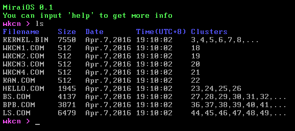
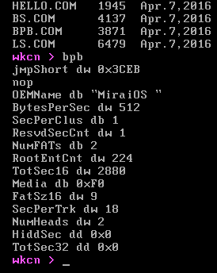
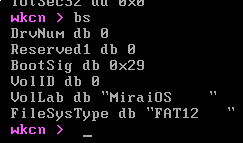

### lab5 中断机制编程技术

1. 实现进程的多个状态: 就绪态, 运行态, 挂起态, 阻塞态, 终止态，能方便地完成有效状态的切换
2. PCB 表基本完全由 C++管理
3. 实现了 top 指令, 能够显示全部进程及其详细信息
4. 能够通过用户指令唤醒, 挂起, 结束单个进程
5. 实现 int 20h 中断, 可以在用户程序中调用此中断, 结束该程序, 返回 Shell,不会影响其他程序.
6. 实现 clock()函数, 使计时精确到秒.
7. 支持用户指令调用中断(有权限管理)
8. 使用了加锁机制管理共享变量.
9. 实现了 fork()函数
10. 使用端口机制实现了进程间的通信，并且带有信号量
11. 32 位 G++与 16 位 NASM 交叉编译时中断处理程序的实现

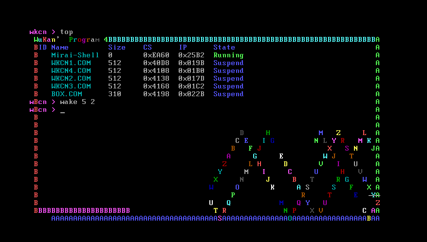
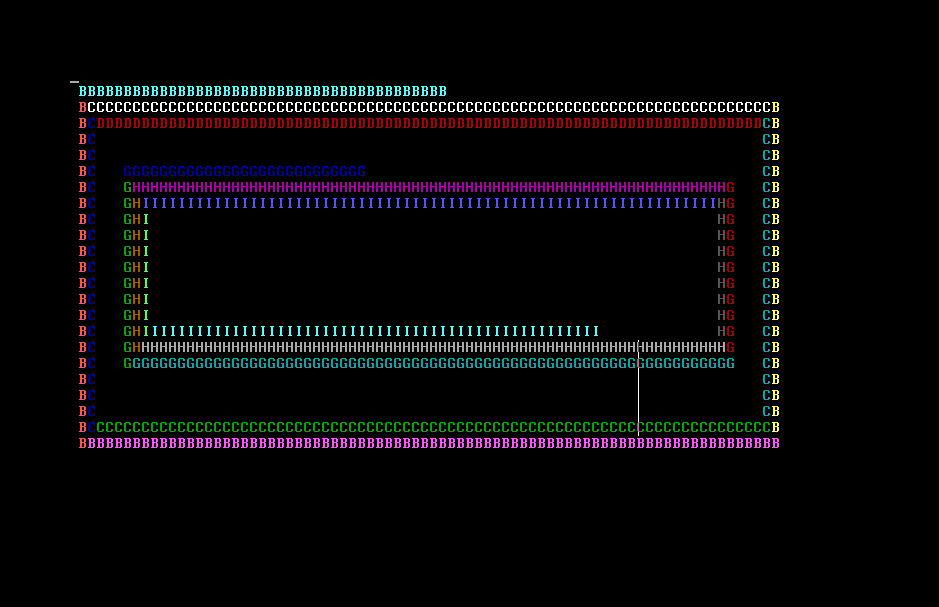

### lab6 多进程和多线程模型

1. 多线程模型的实现: thread_create, thread_join
2. 进程优先级的实现
3. 正确的 fork()函数(更正返回值了)
4. 进程通信(在上一个实验中已实现, 这里再提一下)
5. 中断分支使用跳转表

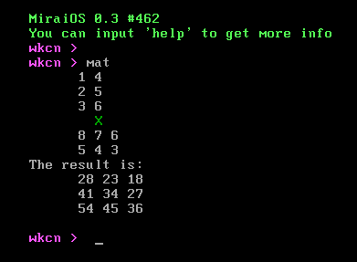
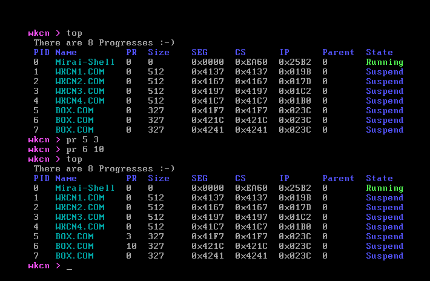
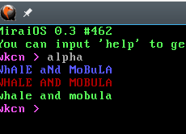

### lab7 信号量与动态内存管理

1. 信号量的实现 semWait(P 操作)， semWait(V 操作)
2. 信号量的手动与自动释放机制
3. 动态内存管理（内核为用户程序申请释放内存空间， 用户程序内部申请释放内存资源（实现了 C++的 new 和 delete） ）
4. 完善了 C++实现中断程序的机制

### lab8 多终端、文件读写与操作

1. 实现了多用户（终端）
2. 实现了文件读写（open, write, read, seekp, seekg）
3. 实现了文件操作（rm,cp,mv）

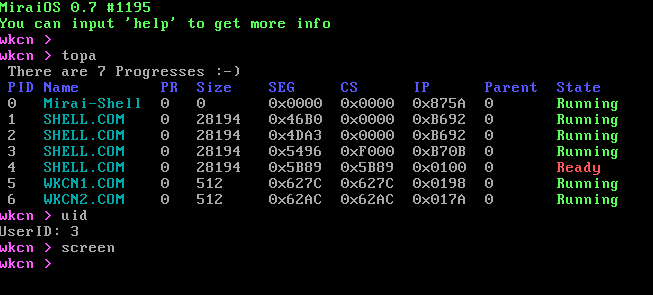
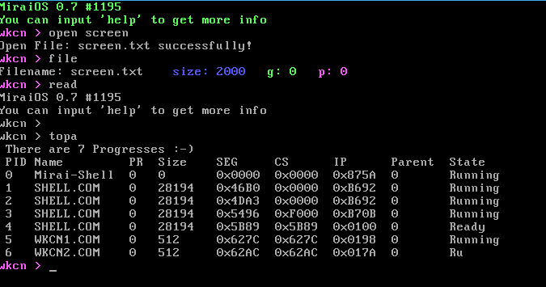
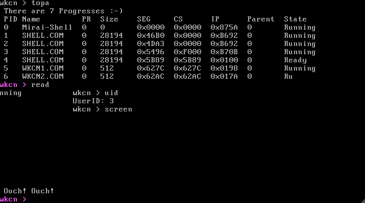

## 欢乐QQ堂ASM版

实现制作了汇编版的 QQ 堂，使用了 VGA 320x200 256 色视频显示, FAT12 文件系统、时钟中断，nasm + gcc 联合编译，通过端口设置调色板。其中除了 AI，游戏界面、逻辑等均由汇编实现。游戏具有良好的图形界面，流畅的操作性，令人愉快的玩法，并且有AI与你作战！

